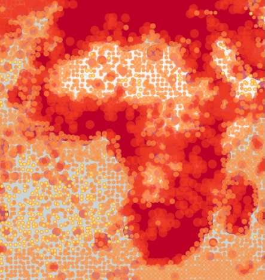
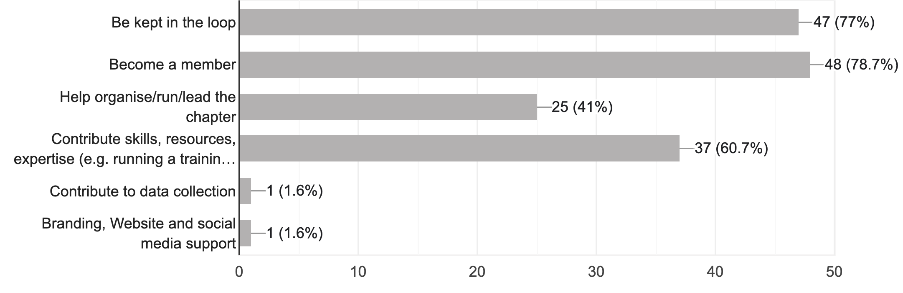

# Ecoforecast Africa {.smaller .center background-color="#33431e"}

{width="100%"}

Jasper Slingsby

::: {style="font-size: 50%;"}

Centre for Statistics in Ecology, the Environment and Conservation, Department of Biological Sciences, University of Cape Town

South African Environmental Observation Network, Fynbos Node

:::


## Why an EFI for Africa? {.smaller background-color="#33431e"}

Most data products that inform global policy are developed in the Global North, but these are erroneous in places, largely due to lack of local knowledge...

```{r echo = F, fig.align = 'center', out.width = '90%'}
knitr::include_app("https://www.globalforestwatch.org/map/", 
  height = "400px")
```

Being "stakeholders" is not good enough. We need Africans holding the reigns.

::: {style="font-size: 50%;"}

www.globalforestwatch.org

:::

## Everyone else is getting one? {.smaller background-color="#33431e"}

::: columns

::: {.column width="45%"}
{width="100%"}
{width="100%"}
:::

::: {.column width="45%"}
{width="100%"}
{width="100%"}
:::

::::

We don't want Africa left behind... again...


## Africa contribute significant data... {.smaller background-color="#33431e"}

::: columns

::: {.column width="50%"}



:::

::: {.column width="50%"}


But either the data are not being sufficiently used, or when they are, we tend to collaborate with folks outside Africa to analyse it...

<br>

Collaboration within Africa is limited, and often dominated by Global North partners.

<br>

This often contributes to global data products or theory, but less often to local needs.


:::

::::

## So what are we doing? {.smaller background-color="#c2c190"}

::: columns
::: {.column width="50%"}

<br>

](img/EcoforecastAfricaWebsite.png){width="100%"}
:::

::: {.column width="50%"}

<br>

-   Building a community of practice to develop ecoforecasting capacity in Africa

-   Web form for sign-ups and advertised through various channels

-   Held our first meeting to discuss and plan the way forward in May
    - Early days, but we have a lot of interest and enthusiasm
    
:::
:::

## So what are we doing? {.smaller background-color="#c2c190"}

::: columns
::: {.column width="50%"}

<br>

{width="100%"}
:::

::: {.column width="50%"}


<br>

-   Running an in-person training workshop 
    - 21-25 July 2025
    - Cape Town, South Africa
-   Instruction led by Prof Mike Dietze, Boston University, USA and EFI founder
    -   Supported by UCT-SEEC and SAEON
    
:::
:::

## Interest in Ecoforecast Africa so far? {.smaller background-color="#c2c190"}

```{r}
library(ggplot2)
library(dplyr)
library(googlesheets4)
library(viridis)

gs4_auth(email = "jslingsby@gmail.com")

dat = read_sheet("https://docs.google.com/spreadsheets/d/18NHGbF6ItGMOvmCg8c7ut4k5R_fqlBDAYViTihhcXwc/edit?resourcekey#gid=1238861919")

dcontdf <- dat %>% group_by(Continent) %>% summarise(value = n())

ddf <- dat %>% group_by(Country) %>% summarise(value = n())

world <- map_data("world")

world %>%
  merge(ddf, by.x = "region", by.y = "Country", all.x = T) %>%
  arrange(group, order) %>%
  ggplot(aes(x = long, y = lat, group = group, fill = value)) +
  geom_polygon(color = "white", linewidth = 0.2) +
  scale_fill_viridis("", na.value = "gray90") +
  theme_minimal() +
  theme(axis.text = element_blank(),
        axis.title = element_blank(),
        panel.grid = element_blank())
```

Africa `r dcontdf$value[which(dcontdf$Continent == "Africa")]` (`r dat %>% filter(Continent == "Africa") %>% select(Country) %>% unique() %>% nrow()` countries) | North America `r dcontdf$value[which(dcontdf$Continent == "North America")]` | Europe `r dcontdf$value[which(dcontdf$Continent == "Europe")]` | Asia `r dcontdf$value[which(dcontdf$Continent == "Asia")]` | Many from or work in Africa

## Interest in Ecoforecast Africa so far? {.smaller background-color="#c2c190"}


```{r echo=FALSE, fig.cap = "", fig.width=6, fig.align = 'center', warning = F, message = F, out.width="125%"}

# Make summary data
cridata <- dat %>% group_by(Role) %>% summarize(count = n()) %>%na.omit()

# Shorten labels and add linebreaks
cridata <- cridata %>% mutate(label = recode(Role, 
                          "Decision maker (e.g. conservation practitioner, government official, etc)" = "Decision maker",
                          "Faculty (Lecturer, Prof, etc)" = "Faculty",
                          "Non-academic Researcher" = "Non-academic \n Researcher"))

# Compute percentages
cridata$fraction <- cridata$count / sum(cridata$count)

# Compute the cumulative percentages (top of each rectangle)
cridata$ymax <- cumsum(cridata$fraction)

# Compute the bottom of each rectangle
cridata$ymin <- c(0, head(cridata$ymax, n=-1))

# Compute label position
cridata$labelPosition <- (cridata$ymax + cridata$ymin) / 2

# Make the plot
ggplot(cridata, aes(ymax=ymax, ymin=ymin, xmax=4, xmin=3, fill=label)) +
  geom_rect() +
  geom_text(x=4.6, aes(y=labelPosition, label=label, color=label)) + # x here controls label position (inner / outer)
  scale_fill_brewer(palette="Set1", direction = 1) +
  scale_color_brewer(palette="Set1", direction = 1) +
  coord_polar(theta="y") +
  xlim(c(2, 4.5)) +
  theme_void() +
  theme(legend.position = "none")
```


## Interest in Ecoforecast Africa so far? {.smaller background-color="#c2c190"}

<br/>  

{width="100%"}


Great willingness to contribute skills!!! Especially from members of other EFIs

<br/> 

Much interest in research collaboration too!


## Please sign up! {background-color="#33431e"}

::: columns
::: {.column width="50%"}
{width="100%"}
:::
::: {.column width="50%"}

[https://ecoforecast.africa/join](https://ecoforecast.africa/join)

:::
:::

## Where to from here? {.smaller background-color="#33431e"}

- What model to adopt re governance? 
  - Steering committee and working groups?

- Expanding across Africa
  - Talks/Sessions at conferences?
  - Online seminars?
  - Running courses?

- Student group?
    - To help build capacity and provide a platform for students to learn and contribute.

- Funding?
  - EU-linked?

- SEEC and Ecological Forecasting?

## Please sign up! {background-color="#33431e"}

::: columns
::: {.column width="50%"}
{width="100%"}
:::
::: {.column width="50%"}

[https://ecoforecast.africa/join](https://ecoforecast.africa/join)

:::
:::

# Thanks!!! {.center background-color="#33431e"}

https://ecoforecast.africa

